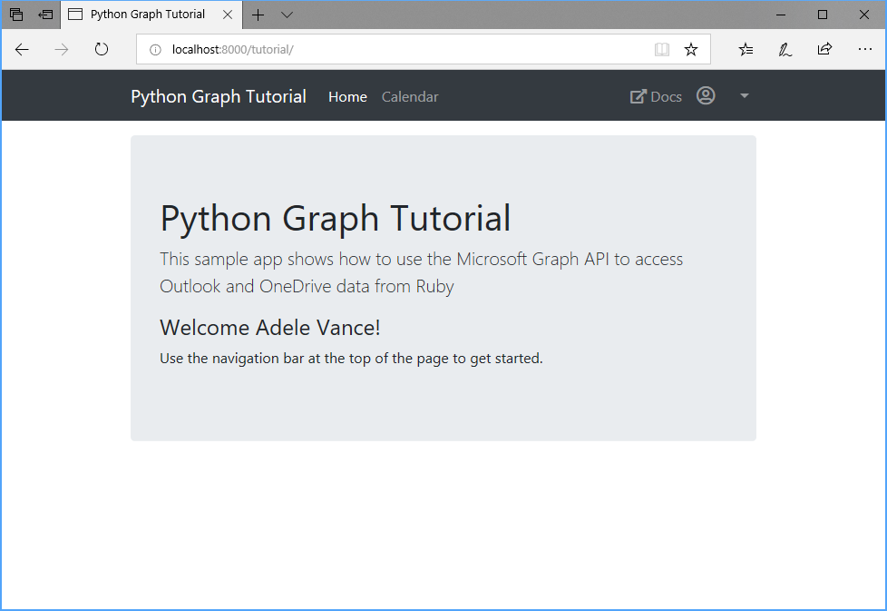
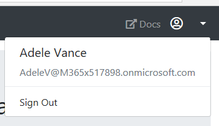

<!-- markdownlint-disable MD002 MD041 -->

In this exercise you will extend the application from the previous exercise to support authentication with Azure AD. This is required to obtain the necessary OAuth access token to call the Microsoft Graph. In this step you will integrate the [Requests-OAuthlib](https://requests-oauthlib.readthedocs.io/en/latest/) library into the application.

1. Create a new file in the root of the project named `oauth_settings.yml`, and add the following content.

    :::code language="ini" source="../demo/graph_tutorial/oauth_settings.yml.example":::

1. Replace `YOUR_APP_ID_HERE` with the application ID from the Application Registration Portal, and replace `YOUR_APP_SECRET_HERE` with the password you generated.

> [!IMPORTANT]
> If you're using source control such as git, now would be a good time to exclude the **oauth_settings.yml** file from source control to avoid inadvertently leaking your app ID and password.

## Implement sign-in

1. Create a new file in the **./tutorial** directory named `auth_helper.py` and add the following code.

    :::code language="python" source="../demo/graph_tutorial/tutorial/auth_helper.py" id="FirstCodeSnippet":::

    This file will hold all of your authentication-related methods. The `get_sign_in_url` generates an authorization URL, and the `get_token_from_code` method exchanges the authorization response for an access token.

1. Add the following `import` statements to the top of **./tutorial/views.py**.

    ```python
    from django.urls import reverse
    from tutorial.auth_helper import get_sign_in_url, get_token_from_code
    ```

1. Add a sign-in view in the **./tutorial/views.py** file.

    :::code language="python" source="../demo/graph_tutorial/tutorial/views.py" id="SignInViewSnippet":::

1. Add a callback view in the **./tutorial/views.py** file.

    ```python
    def callback(request):
      # Get the state saved in session
      expected_state = request.session.pop('auth_state', '')
      # Make the token request
      token = get_token_from_code(request.get_full_path(), expected_state)
      # Temporary! Save the response in an error so it's displayed
      request.session['flash_error'] = { 'message': 'Token retrieved', 'debug': format(token) }
      return HttpResponseRedirect(reverse('home'))
    ```

    Consider what these views do:

    - The `signin` action generates the Azure AD signin URL, saves the `state` value generated by the OAuth client, then redirects the browser to the Azure AD signin page.

    - The `callback` action is where Azure redirects after the signin is complete. That action makes sure the `state` value matches the saved value, then uses the authorization code sent by Azure to request an access token. It then redirects back to the home page with the access token in the temporary error value. You'll use this to verify that our sign-in is working before moving on.

1. Open **./tutorial/urls.py** and replace the existing `path` statements for `signin` with the following.

    ```python
    path('signin', views.sign_in, name='signin'),
    ```

1. Add a new `path` for the `callback` view.

    ```python
    path('callback', views.callback, name='callback'),
    ```

1. Start the server and browse to `https://localhost:8000`. Click the sign-in button and you should be redirected to `https://login.microsoftonline.com`. Login with your Microsoft account and consent to the requested permissions. The browser redirects to the app, showing the token.

### Get user details

1. Create a new file in the **./tutorial** directory named `graph_helper.py` and add the following code.

    :::code language="python" source="../demo/graph_tutorial/tutorial/graph_helper.py" id="FirstCodeSnippet":::

    The `get_user` method makes a GET request to the Microsoft Graph `/me` endpoint to get the user's profile, using the access token you acquired previously.

1. Update the `callback` method in **./tutorial/views.py** to get the user's profile from Microsoft Graph. Add the following `import` statement to the top of the file.

    ```python
    from tutorial.graph_helper import get_user
    ```

1. Replace the `callback` method with the following code.

    ```python
    def callback(request):
      # Get the state saved in session
      expected_state = request.session.pop('auth_state', '')
      # Make the token request
      token = get_token_from_code(request.get_full_path(), expected_state)

      # Get the user's profile
      user = get_user(token)
      # Temporary! Save the response in an error so it's displayed
      request.session['flash_error'] = { 'message': 'Token retrieved',
        'debug': 'User: {0}\nToken: {1}'.format(user, token) }
      return HttpResponseRedirect(reverse('home'))
    ```

The new code calls the `get_user` method to request the user's profile. It adds the user object to the temporary output for testing.

## Storing the tokens

Now that you can get tokens, it's time to implement a way to store them in the app. Since this is a sample app, for simplicity's sake, you'll store them in the session. A real-world app would use a more reliable secure storage solution, like a database.

1. Add the following new methods to **./tutorial/auth_helper.py**.

    ```python
    def store_token(request, token):
      request.session['oauth_token'] = token

    def store_user(request, user):
      request.session['user'] = {
        'is_authenticated': True,
        'name': user['displayName'],
        'email': user['mail'] if (user['mail'] != None) else user['userPrincipalName']
      }

    def get_token(request):
      token = request.session['oauth_token']
      return token

    def remove_user_and_token(request):
      if 'oauth_token' in request.session:
        del request.session['oauth_token']

      if 'user' in request.session:
        del request.session['user']
    ```

1. Update the `callback` function in **./tutorial/views.py** to store the tokens in the session and redirect back to the main page. Replace the `from tutorial.auth_helper import get_sign_in_url, get_token_from_code` line with the following.

    ```python
    from tutorial.auth_helper import get_sign_in_url, get_token_from_code, store_token, store_user, remove_user_and_token, get_token
    ```

1. Replace the `callback` method with the following.

    :::code language="python" source="../demo/graph_tutorial/tutorial/views.py" id="CallbackViewSnippet":::

## Implement sign-out

1. Add a new `sign_out` view in **./tutorial/views.py**.

    :::code language="python" source="../demo/graph_tutorial/tutorial/views.py" id="SignOutViewSnippet":::

1. Open **./tutorial/urls.py** and replace the existing `path` statements for `signout` with the following..

    ```python
    path('signout', views.sign_out, name='signout'),
    ```

1. Restart the server and go through the sign-in process. You should end up back on the home page, but the UI should change to indicate that you are signed-in.

    

1. Click the user avatar in the top right corner to access the **Sign Out** link. Clicking **Sign Out** resets the session and returns you to the home page.

    

## Refreshing tokens

At this point your application has an access token, which is sent in the `Authorization` header of API calls. This is the token that allows the app to access the Microsoft Graph on the user's behalf.

However, this token is short-lived. The token expires an hour after it is issued. This is where the refresh token becomes useful. The refresh token allows the app to request a new access token without requiring the user to sign in again. Update the token management code to implement token refresh.

1. Replace the existing `get_token` method in **./tutorial/auth_helper.py** with the following.

    :::code language="python" source="../demo/graph_tutorial/tutorial/auth_helper.py" id="GetTokenSnippet":::

    This method first checks if the access token is expired or close to expiring. If it is, then it uses the refresh token to get new tokens, then updates the cache and returns the new access token.
