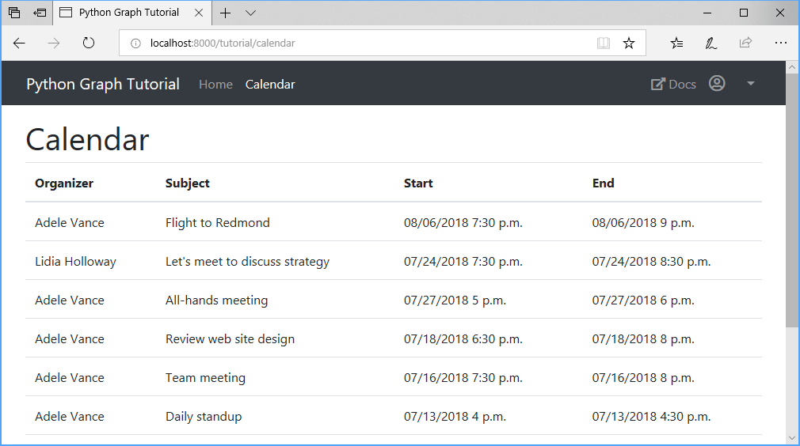

<!-- markdownlint-disable MD002 MD041 -->

In this exercise you will incorporate the Microsoft Graph into the application. For this application, you will use the [Requests-OAuthlib](https://requests-oauthlib.readthedocs.io/en/latest/) library to make calls to Microsoft Graph.

## Get calendar events from Outlook

Start by adding a method to `./tutorial/graph_helper.py` to fetch the calendar events. Add the following method.

```python
def get_calendar_events(token):
  graph_client = OAuth2Session(token=token)

  # Configure query parameters to
  # modify the results
  query_params = {
    '$select': 'subject,organizer,start,end',
    '$orderby': 'createdDateTime DESC'
  }

  # Send GET to /me/events
  events = graph_client.get('{0}/me/events'.format(graph_url), params=query_params)
  # Return the JSON result
  return events.json()
```

Consider what this code is doing.

- The URL that will be called is `/v1.0/me/events`.
- The `$select` parameter limits the fields returned for each events to just those the view will actually use.
- The `$orderby` parameter sorts the results by the date and time they were created, with the most recent item being first.

Now create a calendar view. First change the `from tutorial.graph_helper import get_user` line to the following.

```python
from tutorial.graph_helper import get_user, get_calendar_events
```

Then, add the following view to `./tutorial/views.py`.

```python
def calendar(request):
  context = initialize_context(request)

  token = get_token(request)

  events = get_calendar_events(token)

  context['errors'] = [
    { 'message': 'Events', 'debug': format(events)}
  ]

  return render(request, 'tutorial/home.html', context)
```

Update `./tutorial/urls.py` to add this new view.

```python
path('calendar', views.calendar, name='calendar'),
```

Finally, update  the **Calendar** link in `./tutorial/templates/tutorial/layout.html` to link to this view. Replace the `<a class="nav-link active" href="#">Calendar</a>` line with the following.

```html
<a class="nav-link active" href="">Calendar</a>
```

Now you can test this. Sign in and click the **Calendar** link in the nav bar. If everything works, you should see a JSON dump of events on the user's calendar.

## Display the results

Now you can add a template to display the results in a more user-friendly manner. Create a new file in the `./tutorial/templates/tutorial` directory named `calendar.html` and add the following code.

```html


<h1>Calendar</h1>
<table class="table">
  <thead>
    <tr>
      <th scope="col">Organizer</th>
      <th scope="col">Subject</th>
      <th scope="col">Start</th>
      <th scope="col">End</th>
    </tr>
  </thead>
  <tbody>
    
      
        <tr>
          <td>{{ event.organizer.emailAddress.name }}</td>
          <td>{{ event.subject }}</td>
          <td>{{ event.start.dateTime|date:'SHORT_DATETIME_FORMAT' }}</td>
          <td>{{ event.end.dateTime|date:'SHORT_DATETIME_FORMAT' }}</td>
        </tr>
      
    
  </tbody>
</table>

```

That will loop through a collection of events and add a table row for each one. Add the following `import` statement to the top of the `./tutorials/views.py` file.

```python
import dateutil.parser
```

Replace the `calendar` view in `./tutorial/views.py` with the following code.

```python
def calendar(request):
  context = initialize_context(request)

  token = get_token(request)

  events = get_calendar_events(token)

  if events:
    # Convert the ISO 8601 date times to a datetime object
    # This allows the Django template to format the value nicely
    for event in events['value']:
      event['start']['dateTime'] = dateutil.parser.parse(event['start']['dateTime'])
      event['end']['dateTime'] = dateutil.parser.parse(event['end']['dateTime'])

    context['events'] = events['value']

  return render(request, 'tutorial/calendar.html', context)
```

Refresh the page and the app should now render a table of events.

